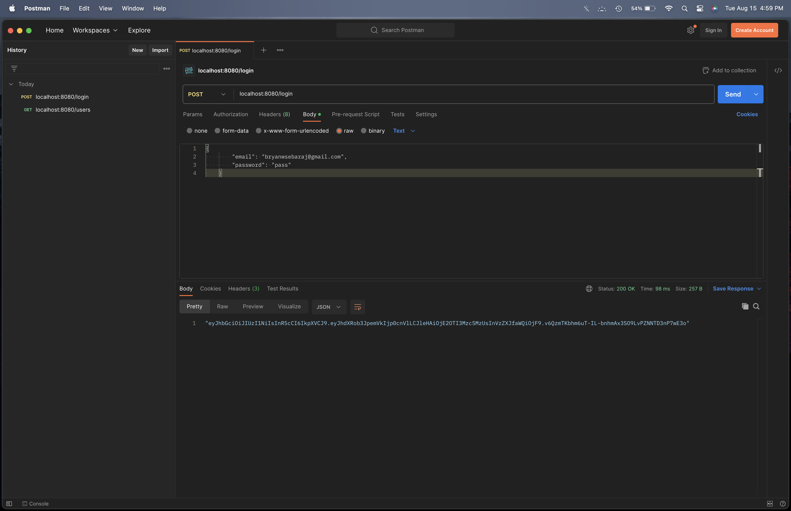
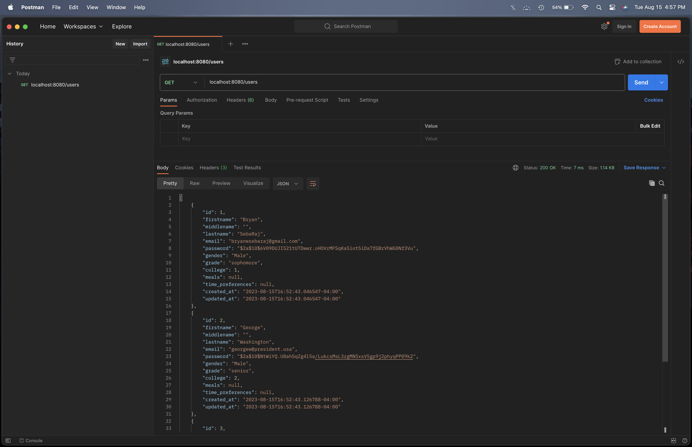
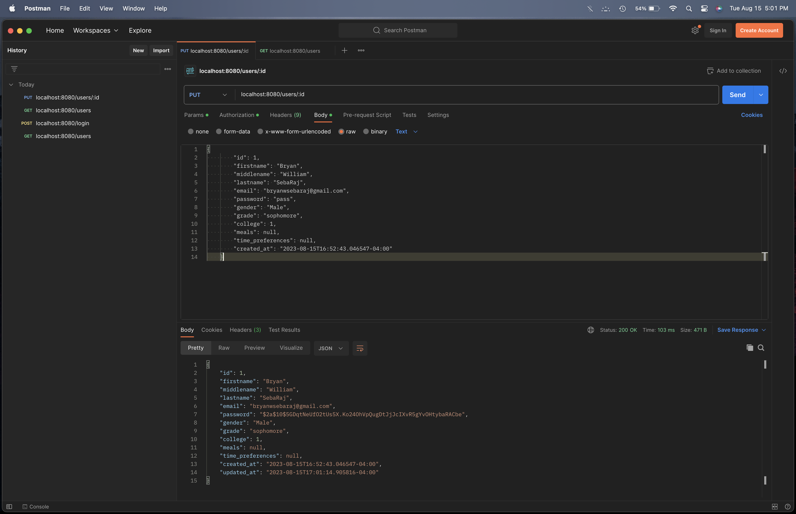
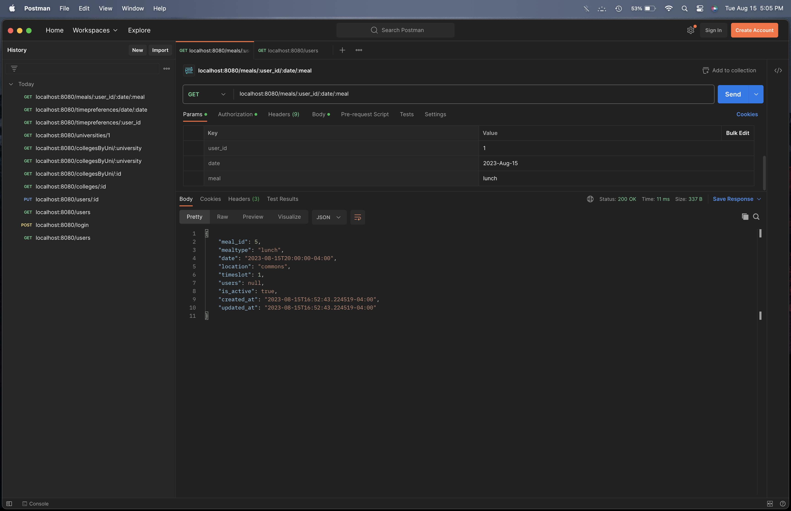
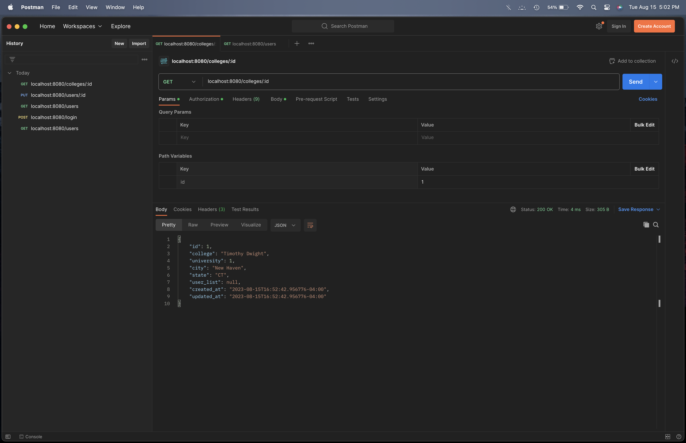
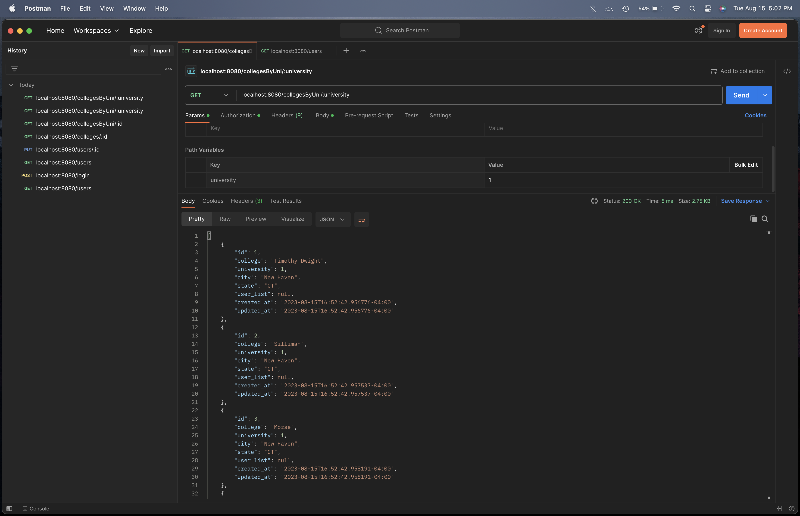
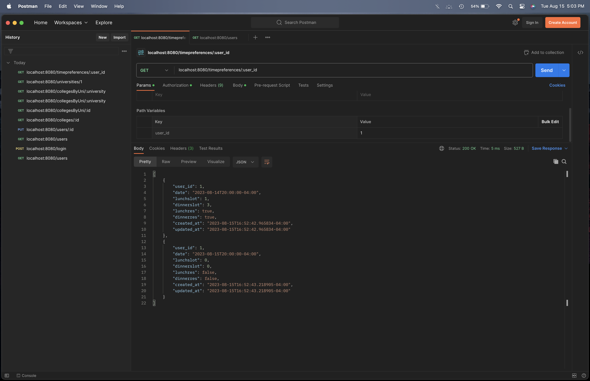
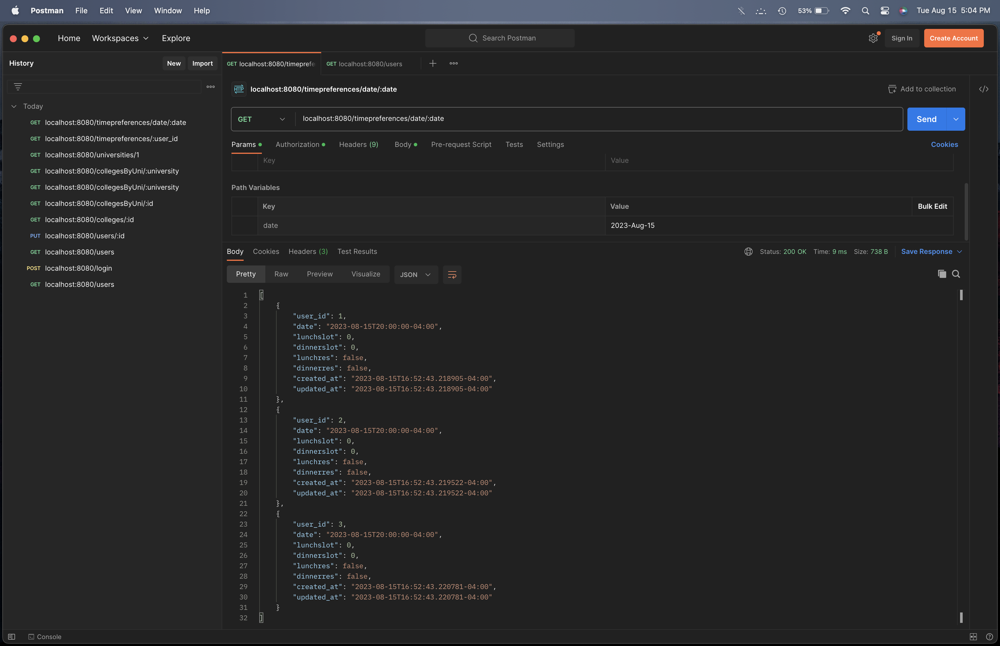

# Meals With Friends

Backend of a novel application to match users based on various preferences/university and generate a convenient time/location to meet for a meal. Built with Go, Gorilla Mux, GORM, and Postgresql. Codebase adhears to standard [Go project layout](https://github.com/golang-standards/project-layout)

## Features
- REST API for client CRUD operations on users, colleges, universities, time preferences, and meal matches
- System creates new time preferences for the upcoming day for all users at 4:00 AM, and generates meal placements for the upcoming day using the previous day's time preferences for users at 4:30 AM

## DB ERD                         

## To-Do
- [ ] Document API using Swagger
- [ ] Add additional preference options, such as meal location and common interests
- [ ] Improve matching algorithm to consider for above preferences and to prioritize unique meal matches (with new users) 
- [ ] Add chat feature for users in shared meal using a refactored ChatWithFriends (https://github.com/bryanwsebaraj/ChatWithFriends)

## Testing
### PostgreSQL
- Install PostgreSQL
	- `brew install postgresql@15`
	- `initdb /usr/local/var/postgres/`
- Start PostgreSQL
	- `brew services start postgresql` (for postgres to run as background service)
    - `pg_ctl -D /usr/local/var/postgres/ start` (for postgres to run normally)
    - `psql postgres`
	- `CREATE USER db_user_in_env PASSWORD 'db_password_in_env';`
	- `CREATE DATABASE db_name_in_env;`

### Start API
 - Navigate to ~
 - Create .env file with appropriate credentials for:
	- `DB_HOST, DB_USER, DB_PASSWORD, DB_NAME, DB_PORT` 
    - 127.0.0.1 is localhost and 5432 is postgres default port
 - run 'go run main.go'

## Postman Screenshots
 Log In                                 | Get User List
:--------------------------------------:|:--------------------------------------:
|

 Update User                            | Get Meal By User, Date, and Meal Type
:--------------------------------------:|:--------------------------------------:
|

 Get College By ID                      | Get College By University
:--------------------------------------:|:--------------------------------------:
|

 Time Preference By User                | Time Preference By Date
:--------------------------------------:|:--------------------------------------:
|
